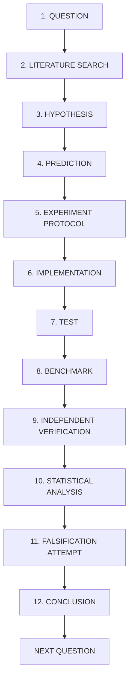

# The 12-Step Scientific Research Loop — Ising Engine

Authority: Standard Operating Procedure for All Future Algorithmic Investigations

## Step-by-Step Directives

1. **QUESTION**: Identify an unexplained empirical phenomenon, an unsolved bottleneck, or a theoretical gap.
2. **LITERATURE SEARCH**: Survey prior art via `research-literature` skill. Identify whether the question has been solved, partially answered, or declared open in published papers. Check competing methods.
3. **HYPOTHESIS**: Formulate a single, directional, falsifiable proposition.
4. **PREDICTION**: State exact quantitative numerical expectations before running code (e.g. "If hypothesis holds, metric M will decrease by $\ge X\%$ under condition C").
5. **EXPERIMENT PROTOCOL**: Write and freeze `research/experiments/<exp_id>/protocol.md`. Specify instances, seeds, baselines, timeouts, and success criteria.
6. **IMPLEMENTATION**: Smallest targeted code change in solver branch. Zero heap allocations in hot loops.
7. **TEST**: Pass all unit, integration, and energy equivalence tests (`cargo test --release`).
8. **BENCHMARK**: Execute standardized benchmark run logging machine-readable `metadata.json` and raw unedited data.
9. **INDEPENDENT VERIFICATION**: Verify every output using an external/official checker (`check_labs`, `check_stableset`, `check_marketsplit`).
10. **STATISTICAL ANALYSIS**: Compute distribution metrics (median, IQR, TTS_99, Wilcoxon p-value, bootstrap CI). Never evaluate on a single seed.
11. **FALSIFICATION ATTEMPT**: Hand off to `falsification-agent`. Actively probe for data leakage, unfair baselines, hardware bias, or mathematical counterexamples.
12. **CONCLUSION**: Record verdict (`SUPPORTED` / `PARTIALLY_SUPPORTED` / `FALSIFIED`) in `research/CLAIMS.md` and archive failed ideas in `research/FAILED_IDEAS.md`.
