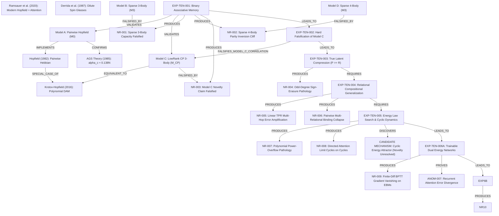

# Scientific Knowledge Graph: Fundamental AI Research

**Document ID:** `research/fundamental_ai/RESEARCH_GRAPH.md`  
**Status:** Graph-Based State Ledger  
**Author:** Autonomous Research Scientist (`ising_engine`)  

---

## 1. Graph Topology (Mermaid)

---

## 2. Node Registry

| Node ID | Type | Description | Epistemic Status |
|---|---|---|---|
| `T_HOP` | Known Theory | Pairwise discrete attractor network | Verified baseline |
| `T_AGS` | Known Theory | Statistical mechanics critical capacity $\alpha_c \approx 0.138$ | Fully reproduced in EXP-TEN-001 |
| `T_DAM` | Known Theory | Polynomial overlap interaction $E = -\sum_\mu (\xi^\mu \cdot s)^n$ | Ground truth for Model C |
| `T_ATT` | Known Theory | Softmax DAM equivalence to Transformer self-attention | Established prior art |
| `M_A` | Model | Dense pairwise Hopfield ($K = N(N-1)/2$) | Standard control |
| `M_B` | Model | Budget-matched sparse 3-body hyperedge memory | Evaluated in EXP-TEN-001 |
| `M_C` | Model | Symmetric CP rank-$P$ 3-body tensor memory | Evaluated; reduced to polynomial DAM |
| `M_D` | Model | Budget-matched sparse 4-body hyperedge memory | Evaluated in EXP-TEN-001 |
| `EXP1` | Experiment | Associative pattern recovery across $N \in \{128, 256, 512\}$ | Concluded (`EXP_TEN_001_RESULT.md`) |
| `EXP2` | Experiment | Hard falsification of Model C vs 1-NN and DAM baselines | Concluded (`EXP_TEN_002_RESULT.md`) |
| `EXP3` | Experiment | True latent compression with $P \gg R$ | Concluded (`EXP_TEN_003_RESULT.md`) |
| `EXP4` | Experiment | Compositional generalization on held-out relational triples | Concluded (`EXP_TEN_004_RESULT.md`) |
| `EXP5` | Experiment | Energy Law Search & Cyclic Constraint Dynamics | Concluded (`EXP_TEN_005_RESULT.md`) |
| `EXP6A` | Experiment | Trainable Dual-Variable Energy Networks on Cyclic Graphs | Concluded; candidate shown to be inert (`EXP_TEN_006_RESULT.md`) |
| `EXP6B` | Experiment | Rigorous Analytical EBM vs Classical Group Synchronization | Concluded ($H_0$ Confirmed; `EXP_TEN_006B_RESULT.md`) |
| `NR1` | Negative Result | Sparse 3-body capacity collapse at $P/N \ge 0.25$ | Conclusively proven |
| `NR2` | Negative Result | 4-body parity inversion at noise $\ge 30\%$ | Conclusively proven |
| `NR3` | Negative Result | Model C novelty falsified by algebraic reduction to DAM | Conclusively proven |
| `NR4` | Negative Result | Odd-degree ($p=3$) energy erases latent coordinate signs | Conclusively proven |
| `NR5` | Negative Result | Linear TPR suffers multi-hop error amplification | Conclusively proven |
| `NR6` | Negative Result | Pairwise models suffer total multi-relational binding collapse | Conclusively proven |
| `NR7` | Negative Result | Monomial power overflow in $p \ge 4$ crushes secondary latents | Conclusively proven |
| `NR8` | Negative Result | Recurrent directed attention stalls at limit cycles on cycles | Conclusively proven |
| `NR9` | Negative Result | Finite-difference BPTT vanishes on energy functionals | Conclusively proven |
| `NR10` | Negative Result | Continuous EBMs/GNNs fail on discrete permutation synchronization due to Inertia-Erosion Dilemma | Conclusively proven in EXP-TEN-006B |
| `ANOM7` | Anomaly | Recurrent attention circulates error; energy has Lyapunov invariance | Artifact of asymmetric baseline degradation; candidate was inert |
| `PRIM` | Candidate Mechanism | Continuous energy relaxation on discrete group constraints | Falsified as reasoning mechanism on discrete groups |

---

## 3. Edge Registry

1. `M_C EQUIVALENT_TO T_DAM`: Proven in `NOVELTY_LEDGER.md` via Newton-Girard symmetric polynomial reduction.
2. `M_A CONFIRMS T_AGS`: Empirical collapse from 82.3% to 0.0% as $P/N$ crosses $0.138$.
3. `EXP1 PRODUCES NR1`: Confirms sparse hyperedges do not overcome $O(N)$ capacity with $O(N^2)$ edges.
4. `EXP1 PRODUCES NR2`: Confirms 4-body parity cliff at 30% noise.
5. `EXP2 FALSIFIES_MODEL_C_CORRELATION`: Proves Model C collapses to 0.0% on correlated/clustered suites while 1-NN reaches 100%.
6. `EXP3 PRODUCES NR4`: Proves odd-degree ($p=3$) energy dynamics square the overlap, unconditionally erasing coordinate signs.
7. `EXP4 PRODUCES NR5 & NR6`: Proves linear TPR error amplification and pairwise relational binding collapse.
8. `EXP5 PRODUCES NR7 & NR8`: Proves polynomial power overflow in latent models and directed attention limit cycles on cyclic graphs.
9. `EXP5 DISCOVERS PRIM`: Shows apparent advantage on fixed triads, later diagnosed as inertia illusion in EXP-TEN-006A-R.
10. `EXP6A PRODUCES NR9 & ANOM7`: Proves finite-difference BPTT vanishes; candidate energy was inert (Rescue Rate = 0.7%).
11. `EXP6B PRODUCES NR10`: Proves continuous energy and GNN relaxation suffer from the Inertia-Erosion Dilemma on discrete permutation constraints (Net Rescue <= +3.7%), while classical Spectral Synchronization (+40.1%) and Loopy Min-Sum (+40.6%) dominate.

